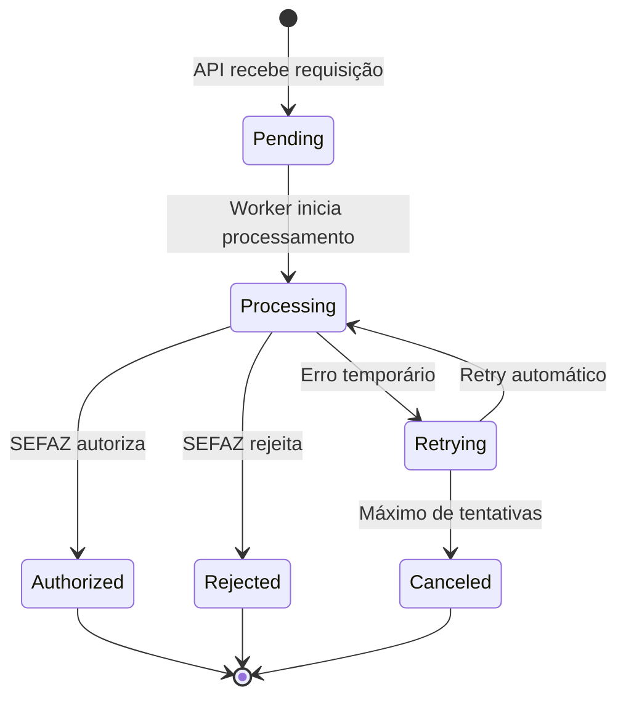

# 🏗️ Arquitetura do Sistema NFC-e

## Visão Geral

O sistema NFC-e implementa uma arquitetura **assíncrona e resiliente** para emissão de Nota Fiscal de Consumidor Eletrônica modelo 65. Utiliza Clean Architecture com separação clara entre API (síncrona) e Worker (assíncrono), garantindo alta disponibilidade e escalabilidade.

## 🏛️ Arquitetura Geral

```
┌─────────────────┐    ┌─────────────────┐    ┌─────────────────┐
│   Controllers   │    │   Use Cases     │    │   Repository    │
│    (HTTP)       │◄──►│   (Business)    │◄──►│   (Database)    │
└─────────────────┘    └─────────────────┘    └─────────────────┘
         │                       │                       │
         ▼                       ▼                       ▼
┌─────────────────┐    ┌─────────────────┐    ┌─────────────────┐
│   Infrastructure│    │   Domain        │    │   External      │
│   (SEFAZ, Queue)│    │   (Entities)    │    │   (PostgreSQL)  │
└─────────────────┘    └─────────────────┘    └─────────────────┘
```

## 🔄 Fluxo Completo do Sistema

### 1. Requisição HTTP → API

```
Cliente ──POST /nfce──► API (Gin)
                       │
                       ▼
                Validação de entrada
                (Schema, Idempotency-Key)
                       │
                       ▼
              Persistir estado inicial
              (PostgreSQL: status="pending")
                       │
                       ▼
             Publicar na fila RabbitMQ
             (Exchange: "nfce.emit")
```

### 2. Processamento Assíncrono → Worker

```
RabbitMQ ──Mensagem──► Worker (Goroutine)
   Queue: "nfce.emit"     │
                          ▼
                   Consumir mensagem
                   (JSON com dados NFC-e)
                          │
                          ▼
                Verificar idempotência
                (Checar se já autorizado)
                          │
                          ▼
                  Processar NFC-e
                  (Fluxo completo abaixo)
```

## 🎯 Fluxo Detalhado do Worker

### Worker Service (`NFCeWorkerService`)

```go
func (s *NFCeWorkerService) ProcessNFceEmission(ctx, nfce) error {
    // 1. VERIFICAÇÃO DE IDEMPOTÊNCIA
    if nfce.Status == "authorized" {
        return nil // Já processado
    }

    // 2. BUILD XML NFC-e
    nfceInput := convertToNFCeInput(nfce.Payload)
    nfceXML := s.xmlBuilder.BuildNFCe(nfceInput)

    // 3. VALIDAÇÃO XSD (pré-assinatura)
    if err := s.xmlValidator.ValidateNFCe(xmlBytes, "4.00"); err != nil {
        return fmt.Errorf("XSD validation failed: %w", err)
    }

    // 4. ASSINATURA DIGITAL
    signedXML := s.xmlSigner.SignEnveloped(xmlBytes, certificate)

    // 5. VALIDAÇÃO XSD (pós-assinatura)
    if err := s.xmlValidator.ValidateNFCe(signedXML, "4.00"); err != nil {
        return fmt.Errorf("Signed XML validation failed: %w", err)
    }

    // 6. COMUNICAÇÃO SEFAZ
    response := s.soapClient.Authorize(ctx, signedXML)

    // 7. PROCESSAR RESPOSTA
    switch response.Status {
    case "authorized":
        return handleAuthorized(nfce, response)
    case "denied":
        return handleRejected(nfce, response)
    }
}
```

## 📊 Estados da NFC-e



## 🏛️ Componentes Principais

### API (`cmd/api/main.go`)

**Responsabilidades:**
- ✅ Receber requisições HTTP REST
- ✅ Validar entrada (JSON Schema)
- ✅ Implementar idempotência (`Idempotency-Key`)
- ✅ Persistir estado inicial no PostgreSQL
- ✅ Publicar mensagens na fila RabbitMQ
- ✅ Retornar resposta síncrona (status inicial)

**Fluxo:**
```go
func main() {
    // 1. Carregar configuração
    cfg := config.InitConfig()

    // 2. Inicializar dependências (Wire)
    server := di.InitializeAPI(ctx, cfg, logger)

    // 3. Iniciar servidor HTTP (porta 8080)
    server.Start(ctx)
}
```

### Worker (`cmd/worker/main.go`)

**Responsabilidades:**
- ✅ Consumir mensagens da fila RabbitMQ
- ✅ Processar NFC-e (XML build, validação, assinatura, SEFAZ)
- ✅ Atualizar status no PostgreSQL
- ✅ Criar eventos de auditoria
- ✅ Implementar retry com backoff exponencial
- ✅ Gerar QR Code NFC-e

**Fluxo:**
```go
func main() {
    // 1. Carregar configuração
    cfg := config.InitConfig()

    // 2. Inicializar dependências (Wire)
    worker := di.InitializeWorker(ctx, cfg, logger)

    // 3. Iniciar processamento assíncrono
    go worker.Start(ctx)

    // 4. Aguardar sinais de shutdown
    <-shutdown
    worker.Stop(ctx)
}
```

## 🔗 Comunicação Entre API e Worker

### RabbitMQ Message Format
```json
{
  "request_id": "uuid-v4",
  "idempotency_key": "user-provided-key",
  "payload": {
    "uf": "SP",
    "ambiente": "homologacao|producao",
    "emitente": {
      "cnpj": "...",
      "ie": "...",
      "csc_id": "...",
      "csc_token": "..."
    },
    "itens": [...],
    "pagamentos": [...]
  }
}
```

### Database Schema
```sql
-- NFC-e requests
CREATE TABLE nfce_requests (
    id UUID PRIMARY KEY,
    idempotency_key VARCHAR UNIQUE,
    status VARCHAR NOT NULL,
    payload JSONB,
    chave_acesso VARCHAR,
    protocolo VARCHAR,
    -- ... outros campos
    created_at TIMESTAMP,
    updated_at TIMESTAMP
);

-- Audit events
CREATE TABLE nfce_events (
    id UUID PRIMARY KEY,
    request_id UUID REFERENCES nfce_requests(id),
    status_from VARCHAR,
    status_to VARCHAR,
    cstat VARCHAR,
    message TEXT,
    created_at TIMESTAMP
);
```

## ⚡ Vantagens da Arquitetura

### Assíncrona
- API responde imediatamente (não bloqueia cliente)
- Worker processa em background
- Melhor experiência do usuário

### Resiliente
- Retry automático com backoff exponencial
- Idempotência evita duplicação
- Estado persistido no banco

### Escalável
- Múltiplas instâncias do Worker
- Fila RabbitMQ distribui carga
- Componentes independentes

### Manutenível
- Separação clara de responsabilidades
- Clean Architecture
- Testabilidade individual

### Auditável
- Eventos completos de auditoria
- Rastreabilidade de todas as transições
- Logs estruturados

## 🎯 Fluxo Típico de Uso

1. **Cliente** faz `POST /nfce` com dados da venda
2. **API** valida, salva como `pending`, retorna ID
3. **Worker** consome mensagem, processa NFC-e
4. **SEFAZ** autoriza/rejeita via SOAP
5. **Worker** atualiza status e cria eventos
6. **Cliente** consulta status via `GET /nfce/{id}`

## 🔧 Componentes Técnicos

### SEFAZ Infrastructure Layer
- **nfce/**: Builder de XML NFC-e modelo 65
- **signer/**: Assinatura digital XMLDSig
- **validator/**: Validação XSD contra schemas oficiais
- **soap/**: Cliente SOAP para comunicação SEFAZ
- **qr/**: Gerador de QR Code NFC-e v3
- **schemas/**: Schemas XSD oficiais da SEFAZ

### Domain Layer
- **Entities**: NFC-e, Event, Company, etc.
- **Services**: Regras de negócio puras
- **Ports**: Interfaces para repositório e infraestrutura

### Infrastructure Layer
- **PostgreSQL**: Persistência de dados
- **RabbitMQ**: Fila de mensagens
- **MinIO**: Storage de arquivos
- **HTTP**: API REST com Gin

## 🚀 Deployment

### Docker Development
```bash
# Iniciar ambiente completo
./scripts/docker-dev.sh up

# Ver logs
./scripts/docker-dev.sh logs api

# Acessar shell
./scripts/docker-dev.sh shell worker
```

### Produção
- API e Worker em containers separados
- Load balancer na frente da API
- Múltiplas instâncias do Worker
- Redis para cache (se necessário)
- Monitoring com Prometheus/Grafana

A arquitetura está preparada para produção com alta disponibilidade e escalabilidade! 🚀
